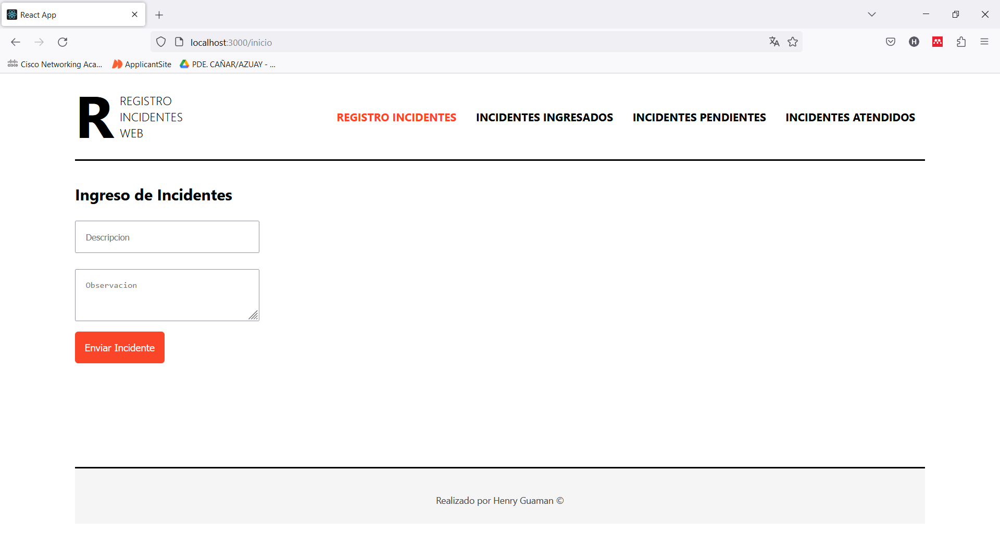
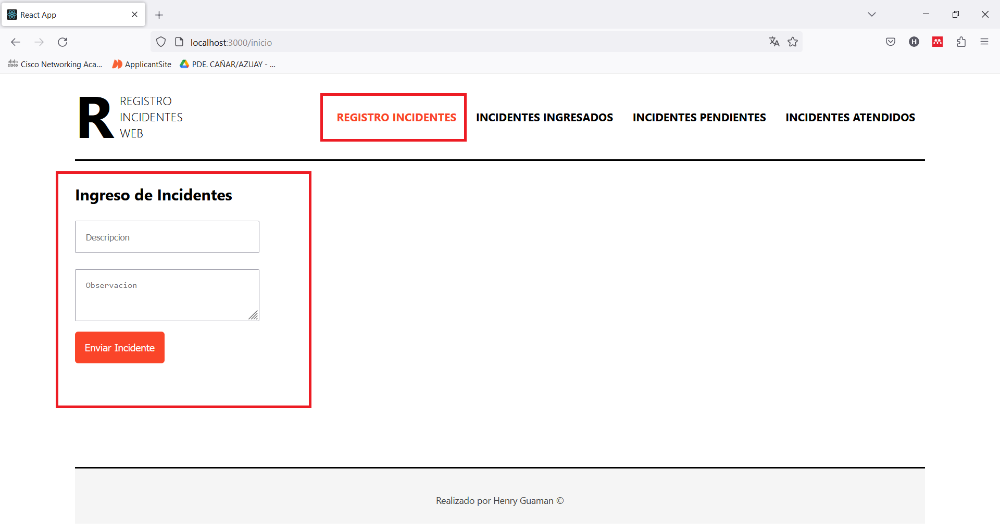
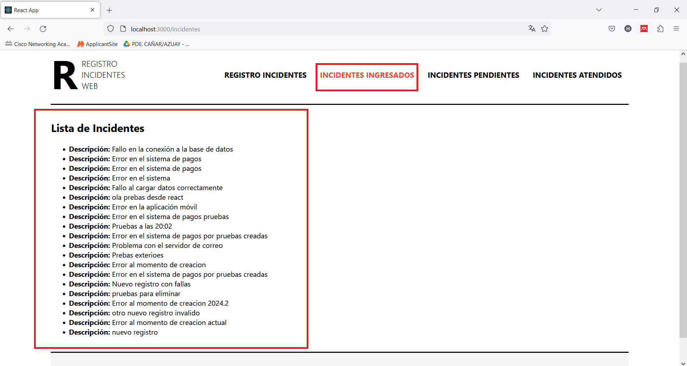
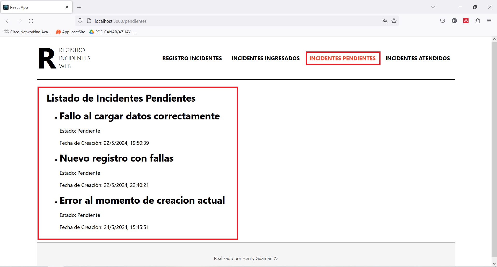
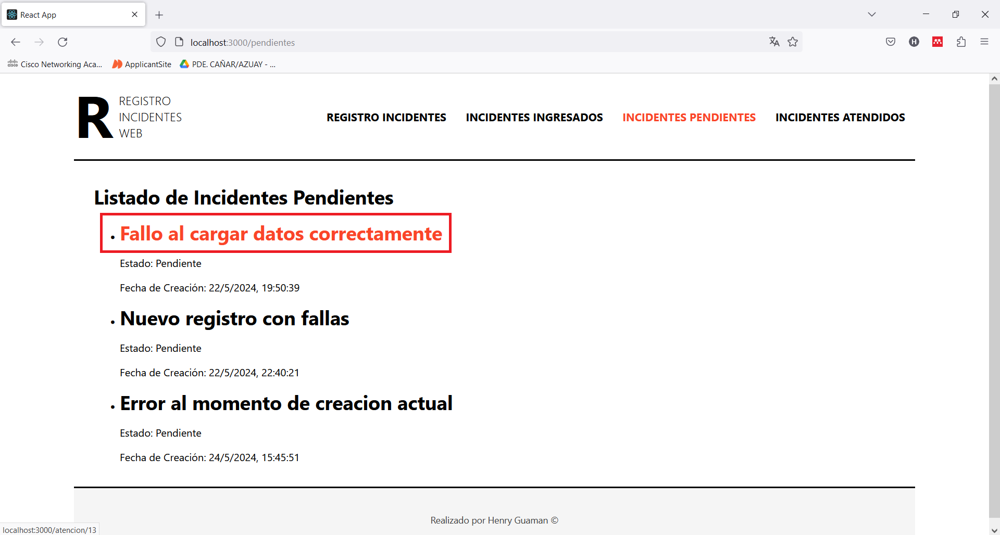
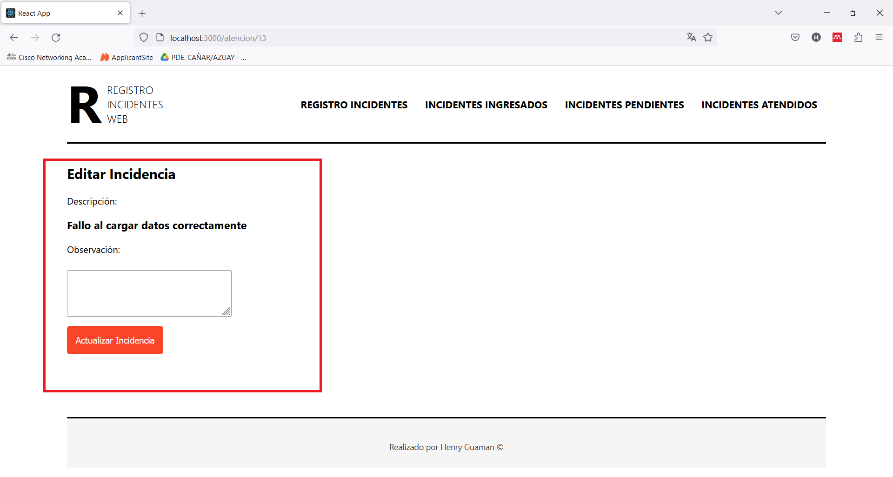
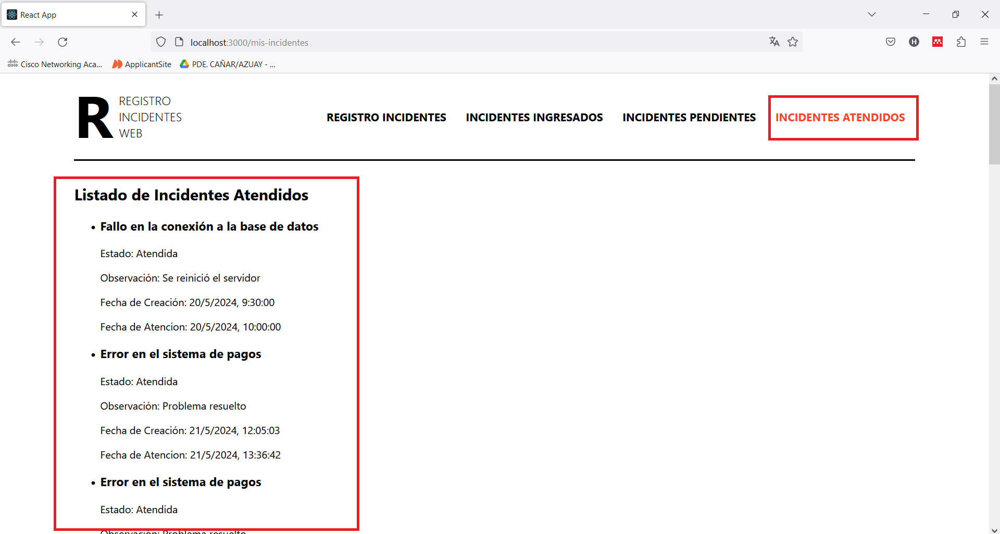

# Requerimiento de automatización Frontend

Lo primero que haremos es clonar este proyecto de forma local para realizar las pruebas correspondientes

## Ejecutaremos el proyecto de la siguiente manera 

### `npm start`

Ejecuta la aplicación en modo de desarrollo.\
Abra [http://localhost:3000](http://localhost:3000) para verlo en su navegador.

Una vez ejecutado el proyecto en el navegador nos aparece de la siguiente manera

## Ahora procederemos a realizar las pruebas correspondientes

### App para el ingreso de incidentes.
Se procedera a registrar un incidente donde le daremos una descripcion y una observacion que pueda tener. Este se creada por defecto como un incidente pendiente para que posteriormente se pueda corregir.

### Página Web para ver el listado de incidentes ingresados.
En este apartado podremos visualizar todos los incidentes que se van ingresando.

### Página Web para ver el listado de incidentes pendientes de ser atendidos.
Aqui podremos ver los incidentes que estan pendientes de ser atendidos es decir los que solo se han registrado.

### Página Web para registrar a atención del incidente.
Aqui para poder registrar un incidente a atencion debemos de dar click sobre el incidente.

Luego de dar click nos aparecera una nueva pagina web donde nos mostrara la descripcion del incidente y tendremos un campo donde podremos poner la observacion pertinente, una vez lleno los datos enviamos el incidente y este pasara a ser atendido.

### App para revisar mis incidentes atendidos.
Aqui se puede ver los incidentes atendidos con su observacion colocada y su estado en Atendido, incluso la hora en la que a sido atendido.

